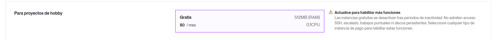

# DevPulse - Guía de Deployment 🚀

Esta guía te ayudará a desplegar DevPulse en plataformas gratuitas de hosting para que cualquiera pueda probarlo.

## 📋 Tabla de Contenidos

- [Prerequisitos](#prerequisitos)
- [1. Preparación del Repositorio](#1-preparación-del-repositorio)
- [2. Deploy del Backend (Railway)](#2-deploy-del-backend-railway)
- [3. Deploy del Frontend (Vercel)](#3-deploy-del-frontend-vercel)
- [4. Configurar GitHub OAuth](#4-configurar-github-oauth)
- [5. Verificación Final](#5-verificación-final)
- [Troubleshooting](#troubleshooting)

---

## Prerequisitos

- ✅ Cuenta de GitHub con el código del proyecto
- ✅ Cuenta de Railway (https://railway.app) - Gratis
- ✅ Cuenta de Vercel (https://vercel.com) - Gratis
- ✅ GitHub OAuth App (opcional, para integración de GitHub)

---

## 1. Preparación del Repositorio

### 1.1 Asegúrate de que todo esté en GitHub

```bash
# Verifica que tengas todos los cambios commiteados
git status

# Si hay cambios pendientes:
git add .
git commit -m "Prepare for deployment"
git push origin main
```

### 1.2 Verifica la estructura del proyecto

Tu proyecto debe tener esta estructura:

```
devpulse/
├── client/          # Frontend Next.js
├── server/          # Backend Express
├── vercel.json      # Configuración de Vercel
└── README.md
```

---

## 2. Deploy del Backend (Railway)

### 2.1 Crear Proyecto en Railway

1. Ve a **[Railway.app](https://railway.app)** e inicia sesión con GitHub
2. Click en **"New Project"**
3. Selecciona **"Deploy from GitHub repo"**
4. Elige tu repositorio `devpulse`
5. Railway detectará automáticamente tu proyecto Node.js

### 2.2 Configurar el Servicio

1. Railway creará un servicio automáticamente
2. Ve a **Settings** del servicio
3. Configura:
   - **Root Directory**: `server`
   - **Build Command**: `npm install && npm run build`
   - **Start Command**: `npm start`

### 2.3 Agregar PostgreSQL Database

1. En tu proyecto de Railway, click en **"+ New"**
2. Selecciona **"Database"** → **"PostgreSQL"**
3. Railway creará automáticamente la base de datos
4. La variable `DATABASE_URL` se configurará automáticamente

### 2.4 Configurar Variables de Entorno

1. Ve a tu servicio backend → **Variables**
2. Agrega las siguientes variables (copia desde `server/.env.example`):

```env
# JWT Configuration
JWT_SECRET=tu_secreto_jwt_super_seguro_cambiar_en_produccion
JWT_EXPIRES_IN=7d

# Server Configuration
NODE_ENV=production
PORT=3001

# CORS - Frontend URL (lo configuraremos después)
FRONTEND_URL=https://tu-app.vercel.app

# GitHub OAuth (opcional - configurar después si quieres la integración)
GITHUB_CLIENT_ID=
GITHUB_CLIENT_SECRET=
```

> **⚠️ IMPORTANTE**: `DATABASE_URL` ya está configurada automáticamente por Railway.

### 2.5 Deploy y Obtener URL

1. Railway automáticamente desplegará tu backend
2. Ve a **Settings** → **Networking** → **Generate Domain**
3. Guarda esta URL, la necesitarás para el frontend
   - Ejemplo: `https://devpulse-production.up.railway.app`

### 2.6 Ejecutar Migraciones de Prisma

1. Ve a tu servicio → **Settings** → **Deploy**
2. Agrega un comando de deploy:
   - En **Build Command**: `npm install && npm run prisma:generate && npm run build`

O manualmente desde tu terminal local:

```bash
# Configurar DATABASE_URL temporalmente
export DATABASE_URL="postgresql://..." # Copia desde Railway

# Ejecutar migraciones
cd server
npx prisma migrate deploy
```

---

## 3. Deploy del Frontend (Vercel)

### 3.1 Importar Proyecto en Vercel

1. Ve a **[Vercel.com](https://vercel.com)** e inicia sesión con GitHub
2. Click en **"Add New..."** → **"Project"**
3. Importa tu repositorio `devpulse`

### 3.2 Configurar el Proyecto

En la configuración del proyecto:

1. **Framework Preset**: Next.js (detectado automáticamente)
2. **Root Directory**: `client` ← **MUY IMPORTANTE**
3. **Build Command**: `npm run build`
4. **Output Directory**: `.next` (por defecto)
5. **Install Command**: `npm install`

### 3.3 Variables de Entorno

En la sección **Environment Variables**, agrega:

```env
# URL del backend de Railway (la que obtuviste en el paso 2.5)
NEXT_PUBLIC_API_URL=https://devpulse-production.up.railway.app/api

# GitHub Client ID (si configuraste OAuth)
NEXT_PUBLIC_GITHUB_CLIENT_ID=tu_github_client_id
```

### 3.4 Deploy

1. Click en **"Deploy"**
2. Vercel construirá y desplegará tu aplicación
3. Espera unos minutos hasta que veas **"Congratulations!"**
4. Guarda tu URL de producción
   - Ejemplo: `https://devpulse.vercel.app`

### 3.5 Actualizar Backend con Frontend URL

1. Regresa a **Railway**
2. Ve a tu servicio backend → **Variables**
3. Actualiza `FRONTEND_URL` con la URL de Vercel:
   ```env
   FRONTEND_URL=https://devpulse.vercel.app
   ```
4. Railway redesplegará automáticamente

---

## 4. Configurar GitHub OAuth

Si quieres que funcione la integración de GitHub:

### 4.1 Crear GitHub OAuth App

1. Ve a **[GitHub Developer Settings](https://github.com/settings/developers)**
2. Click en **"New OAuth App"**
3. Completa:
   - **Application name**: DevPulse
   - **Homepage URL**: `https://devpulse.vercel.app`
   - **Authorization callback URL**: `https://devpulse-production.up.railway.app/api/github/callback`
4. Click en **"Register application"**

### 4.2 Obtener Credenciales

1. Copia el **Client ID**
2. Click en **"Generate a new client secret"** y cópialo

### 4.3 Configurar en Railway

1. Ve a Railway → tu servicio backend → **Variables**
2. Agrega:
   ```env
   GITHUB_CLIENT_ID=tu_client_id_aqui
   GITHUB_CLIENT_SECRET=tu_client_secret_aqui
   ```

### 4.4 Configurar en Vercel

1. Ve a Vercel → tu proyecto → **Settings** → **Environment Variables**
2. Agrega:
   ```env
   NEXT_PUBLIC_GITHUB_CLIENT_ID=tu_client_id_aqui
   ```
3. **Redeploy** el proyecto desde la pestaña **Deployments**

---

## 5. Verificación Final

### ✅ Checklist de Verificación

- [ ] **Backend desplegado en Railway**

  - [ ] Base de datos PostgreSQL conectada
  - [ ] Migraciones ejecutadas
  - [ ] Variables de entorno configuradas
  - [ ] URL pública funcionando

- [ ] **Frontend desplegado en Vercel**

  - [ ] Build exitoso
  - [ ] Variables de entorno configuradas
  - [ ] URL pública funcionando

- [ ] **Conexión Frontend-Backend**

  - [ ] CORS configurado correctamente
  - [ ] API respondiendo desde el frontend

- [ ] **Funcionalidades básicas**

  - [ ] Registro de usuario funciona
  - [ ] Login funciona
  - [ ] Dashboard se carga correctamente
  - [ ] CRUD de clientes funciona
  - [ ] CRUD de proyectos funciona

- [ ] **GitHub Integration** (opcional)
  - [ ] OAuth App configurada
  - [ ] Login con GitHub funciona
  - [ ] Estadísticas se muestran

---

## Troubleshooting

### ❌ Error: "Cannot connect to database"

**Solución**: Verifica que las migraciones de Prisma se hayan ejecutado:

```bash
# En Railway, agrega este comando al build:
npm run prisma:generate && npm run build
```

O ejecútalas manualmente:

```bash
export DATABASE_URL="..." # desde Railway
npx prisma migrate deploy
```

---

### ❌ Error: "CORS policy blocked"

**Solución**: Asegúrate de que en Railway, la variable `FRONTEND_URL` tenga la URL correcta de Vercel:

```env
FRONTEND_URL=https://tu-app.vercel.app
```

---

### ❌ Error: "API endpoint not found" (404)

**Solución**: Verifica que en Vercel, `NEXT_PUBLIC_API_URL` incluya `/api` al final:

```env
NEXT_PUBLIC_API_URL=https://tu-backend.railway.app/api
```

---](image.png)

### ❌ Error de Build en Vercel

**Solución**: Asegúrate de que:

1. Root Directory esté configurado como `client`
2. Node version sea compatible (18+)
3. Todas las dependencias estén en `package.json`

---

### ❌ GitHub OAuth no funciona

**Solución**: Verifica que:

1. La Callback URL en GitHub esté correcta:
   ```
   https://tu-backend.railway.app/api/github/callback
   ```
2. Las credenciales estén en las variables de entorno de Railway
3. `NEXT_PUBLIC_GITHUB_CLIENT_ID` esté en Vercel

---

## 🎉 ¡Listo!

Tu aplicación DevPulse ahora está desplegada y accesible públicamente. Comparte las URLs:

- **Frontend**: `https://tu-app.vercel.app`
- **Backend API**: `https://tu-backend.railway.app/api`

### Próximos pasos:

1. 📱 Comparte la URL con amigos/colegas para testing
2. 🐛 Monitorea logs en Railway y Vercel
3. 📊 Revisa métricas de uso
4. 🔄 Los deployos futuros serán automáticos con cada `git push`

---

## 📞 Soporte

Si encuentras problemas:

1. Revisa los logs en Railway: **Deployments** → Click en el deploy → **View Logs**
2. Revisa los logs en Vercel: **Deployments** → Click en el deploy → **Function Logs**
3. Verifica que todas las URLs y variables estén correctas

---

**Desarrollado con ❤️ para freelancers**
